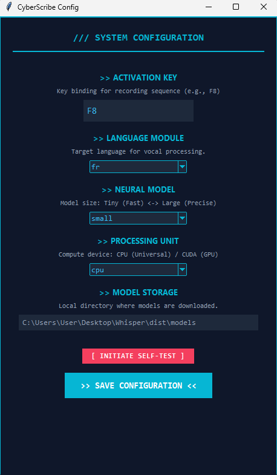

# 🤖 CyberScribe

**CyberScribe** is a local, offline voice transcription tool powered by `faster-whisper`. It features a robot-themed UI, system tray integration, and global hotkeys for instant recording.



## Features

- 🎙️ **Offline Transcription**: Powered by Faster-Whisper.
- 🤖 **Robot Theme**: Custom icons and splash screen.
- ⌨️ **Global Hotkey**: Toggle recording from anywhere (default F8).
- 📋 **Auto-Paste**: Automatically pastes transcribed text.
- ⚙️ **Configurable**: Change models, hotkeys, and language via settings.

## Installation / Compilation

To compile the application into a standalone `.exe`:

1.  **Install Dependencies**:
    ```bash
    pip install faster-whisper pyaudio pystray Pillow pyperclip pyautogui pynput
    ```
    *Note: If `pyaudio` fails, try using `pipwin install pyaudio`.*

2.  **Build with PyInstaller**:
    ```bash
    pyinstaller --noconsole --onefile --noconfirm --hidden-import=pyaudio --hidden-import=pynput.keyboard._win32 --hidden-import=pynput.mouse._win32 --name "CyberScribe" CyberScribe.py
    ```

## Usage

1.  Run the executable.
2.  Wait for the Splash Screen.
3.  Press **F8** (or your configured hotkey) to start recording.
4.  Press **F8** again to stop.
5.  The text will be transcribed and pasted automatically.
