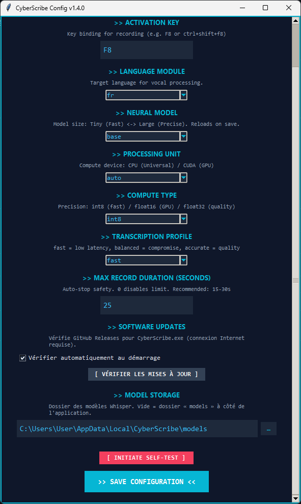

# CyberScribe

**CyberScribe** is a local, offline voice transcription tool for Windows, powered by `faster-whisper`. It lives in the system tray, records from a global hotkey, transcribes on-device, then pastes the text into the active window.



## Features

- **Offline transcription**: Faster-Whisper, models stored next to the app. No cloud.
- **Global hotkey**: Toggle recording from anywhere (default `F8`). Combinations like `ctrl+shift+f8` are supported.
- **Recording overlay**: A compact always-on-top indicator while you speak.
- **Audio feedback**: Beeps on start and stop.
- **Auto-paste**: Copies the transcript and sends Ctrl+V to the focused window.
- **Anti-latency profiles**: Fast, Balanced, Accurate.
- **Smart device detection**: Automatic CUDA (NVIDIA GPU) or CPU.
- **Auto-stop safety**: Configurable maximum recording duration.
- **Single instance**: A second launch is refused so hotkeys do not collide.

## Requirements

- Windows 10/11
- A microphone
- Optional: NVIDIA GPU + current drivers for CUDA acceleration

## Installation / Compilation

### Local Development

```bash
pip install -r requirements.txt
python CyberScribe.py
```

### Build your own EXE

```bash
pip install -r requirements.txt pyinstaller
pyinstaller --noconsole --onefile --noconfirm --hidden-import=pyaudio --hidden-import=pynput.keyboard._win32 --hidden-import=pynput.mouse._win32 --add-data "venv\Lib\site-packages\faster_whisper\assets\silero_vad_v6.onnx;faster_whisper/assets" --icon "app.ico" --name "CyberScribe" CyberScribe.py
```

*(Adjust the path to `silero_vad_v6.onnx` according to your Python environment.)*

## CI/CD (Automated Builds)

This repository uses **GitHub Actions**. Pushing a `v*` tag builds `CyberScribe.exe` on Windows and attaches it to the GitHub Release.

## Usage

1. Run the executable (or `python CyberScribe.py`).
2. Wait until the tray tooltip says **Prêt** — the Whisper model may still be loading on first launch.
3. Press **F8** (or your configured hotkey) to start recording. You will hear a high beep and see the overlay.
4. Press the hotkey again to stop. The transcribed text is pasted into the active window.
5. Open **Configuration** from the tray icon to change hotkey, language, model, device, compute type, profile, and max duration. Changing the model or device reloads Whisper in the background.

## Privacy

Transcription runs entirely on your machine. Application logs record events and error messages, never the dictated text.

## Support

If you like CyberScribe, consider supporting the project!

**Bitcoin (BTC)**: `bc1pt20cczcmvukrny4pru3x2nc522tk2sectlu22d42q2ltyau7t66suh6kqx`
